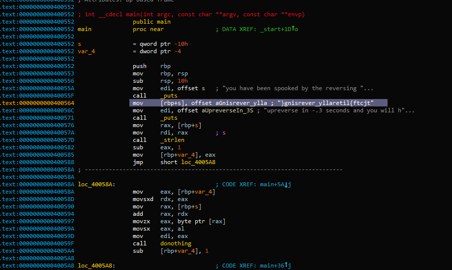

## Reversing - 20 (Binary) ##
#### Writeup by r3ndom_ #####
Created: 2016-6-10

### Problem ###
[Reversing](https://dl.dropboxusercontent.com/u/33547841/reversing_a2cc56665eeacc628a45173d21ee1d82ddec254ee91f79f678165b562e328e42) can be very easy 

## Answer ##

### Overview ###
Open the binary and find the flag, but reversed.

### Details ###

Open the binary in IDA and see this:



Then open a python console and type:

```
>>> "}gnisrever_yllaretil{ftcjt"[::-1]
'tjctf{literally_reversing}'
```

### Flag ###

The flag was `tjctf{literally_reversing}`

