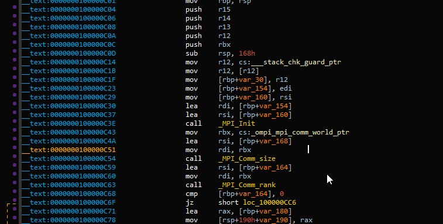
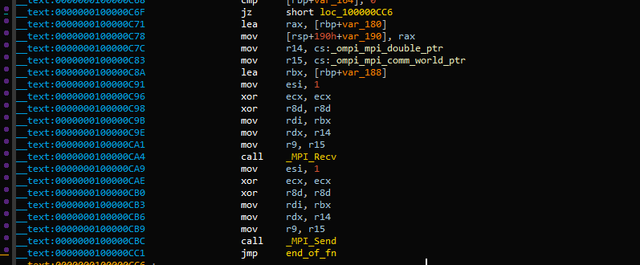
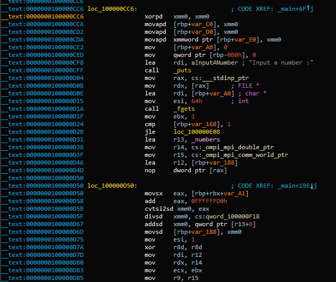
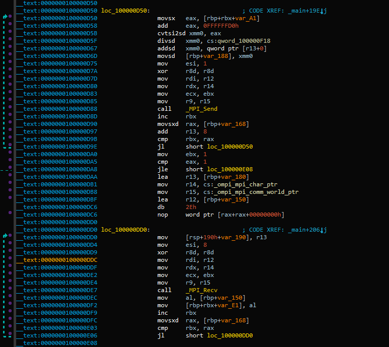

## teamwork - 145 (Binary) ##
#### Writeup by r3ndom_ #####
Created: 2016-6-10

### Problem ###
[teamwork](https://dl.dropboxusercontent.com/u/33547841/teamwork)

## Answer ##

### Overview ###
RE the encryption of the input such that you can crib drag the correct answer from it.

### Details ###

So beginning some simple analysis of the teamwork binary the first thing one notices is tons of references to MPI functions.

Presumably this is where the name "teamwork" comes from as MPI is a message passing interface usually used for parallelism.

While it's somewhat annoying to learn this to solve the problem, MPI is comprable to sockets and I just thought of it as such for the purposes of this problem.



The beginning of the main function does the standard init for a small executable using MPI, setting up the environment then determining if its the first instance of the current binary, if it is then branch, otherwise no.

If it didn't branch the binary is very simple, just take the input as a double and send it back, then terminate.



But if it _is_ the root instance then we get to have fun.

It asks for input of a number into a buffer of 100 bytes using fgets and then if the number of other instances is less than or equal to 1 it branches without encrypting resulting in a failed input always.



If there are 1 or more other instances then the binary will actually encrypt the input, or at least 1 character per number of instances.

The _numbers pointer it `lea`s into r13 is an array of doubles and in hex looks like this:

```c
__int64 vars[] = { 0x4003AB3700474D9C, 0x4020DD796BFCA85D, 0x401C1DB48FBF2544, 0x3FFDD14A0A0F4D7B, 0x40060D2CBEA4EBDD, 0x3FFBF1348B220792, 0x40223425072085B2, 0x401C0112FD32C626, 0x40192CB790FB6567, 0x3FF3B27CBF6E3F79, 0x4022B167B6C87E89, 0x4023496EE590E8F1, 0x40103AEEE957470F, 0x40147EF0F16F4385, 0x3FFF4DB6A1E81CB4, 0x4016846412CF0F9D, 0x400C6004B7F5A533, 0x401255F4E4430B18, 0x4012501711947CFA, 0x4008C0C9539B8887, 0x40157F9FCB0C026D, 0x4022130A915379FB, 0x40052DD1E53A81DC, 0x40224E66234A87E4, 0x400DB6AF038E29FA, 0x400E0B39192641B3, 0x4023171EF30A4E38, 0x402214CDFACA361A, 0x40186ACEAAF35E31, 0x4019B57214F0520D, 0x4009A0C521DDA05A, 0x4011D6BD6E8AF816, 0x401D1DFB9389B520, 0x4007DF7CED916873, 0x401447A4A48F96E1, 0x4020675A1016CE79, 0x402158FB86F47B67, 0x4013250507A6BD6F, 0x4008061AE70C1334, 0x402273F8DB489093, 0x401E3CB9A9DA597D, 0x400F6E11DBCA9692, 0x4013AADA76D97B31, 0x3FFBEA0DBAD3A605, 0x401F0B1C0010C6F8, 0x401E3EC3DAB5C39C, 0x40064A5269595FEE, 0x401AE47C73EEE526, 0x401C1700CD855971, 0x4005411B1D92B7FE, 0x4011B5B89939218A, 0x40223B365881A155, 0x4006884C6A3BDDFD, 0x40159A3443D46B27, 0x401273B14A90470B, 0x400B6CB3A2595BBC, 0x40048178705425F2, 0x40173B0C88A47ED0, 0x4015DD938151A438, 0x401BE0DE4C51116B };
```

In my code I leave them as hex to avoid any potential errors in precision through a print with not enough digits.

The next bit of code may look complicated but I promise, if you remember the stuff from above its really simple.



So knowing that `qword_100000F18` is the double for 10 then we can quickly figure this out. Some basic math occurs on each character of the input after that it converts it to a double. This now double gets divided by 10 and then the double value at the current index in the vars/_numbers array gets added to it. This double is then sent and then recieved and placed into the output buffer.

Remembering that the stuff handling the input before just sends it back we can figure out that the first byte, or least significant byte, of the resulting double of the calculation is the character in the output of the encryption.

So to avoid a bit of a lengthy tangent here I discovered a regular crib-drag where you stop after you find a single correct input doesnt work because there are sometimes multiple working numbers and not all conversions to ascii work as the flag for the input.

As such heres my code to get a python dict for all possible values of each index in the input string:

```c
__int64 vars[] = { 0x4003AB3700474D9C, 0x4020DD796BFCA85D, 0x401C1DB48FBF2544, 0x3FFDD14A0A0F4D7B, 0x40060D2CBEA4EBDD, 0x3FFBF1348B220792, 0x40223425072085B2, 0x401C0112FD32C626, 0x40192CB790FB6567, 0x3FF3B27CBF6E3F79, 0x4022B167B6C87E89, 0x4023496EE590E8F1, 0x40103AEEE957470F, 0x40147EF0F16F4385, 0x3FFF4DB6A1E81CB4, 0x4016846412CF0F9D, 0x400C6004B7F5A533, 0x401255F4E4430B18, 0x4012501711947CFA, 0x4008C0C9539B8887, 0x40157F9FCB0C026D, 0x4022130A915379FB, 0x40052DD1E53A81DC, 0x40224E66234A87E4, 0x400DB6AF038E29FA, 0x400E0B39192641B3, 0x4023171EF30A4E38, 0x402214CDFACA361A, 0x40186ACEAAF35E31, 0x4019B57214F0520D, 0x4009A0C521DDA05A, 0x4011D6BD6E8AF816, 0x401D1DFB9389B520, 0x4007DF7CED916873, 0x401447A4A48F96E1, 0x4020675A1016CE79, 0x402158FB86F47B67, 0x4013250507A6BD6F, 0x4008061AE70C1334, 0x402273F8DB489093, 0x401E3CB9A9DA597D, 0x400F6E11DBCA9692, 0x4013AADA76D97B31, 0x3FFBEA0DBAD3A605, 0x401F0B1C0010C6F8, 0x401E3EC3DAB5C39C, 0x40064A5269595FEE, 0x401AE47C73EEE526, 0x401C1700CD855971, 0x4005411B1D92B7FE, 0x4011B5B89939218A, 0x40223B365881A155, 0x4006884C6A3BDDFD, 0x40159A3443D46B27, 0x401273B14A90470B, 0x400B6CB3A2595BBC, 0x40048178705425F2, 0x40173B0C88A47ED0, 0x4015DD938151A438, 0x401BE0DE4C51116B };


void CribDrag()
{
	char* needstobe = "i*DWCbL&gy#WuR'jf~`!mav~0@8";

	double* vars_ptr = (double*)vars;
	int output_iter = 0;
	int input_iter = 0;
	putchar('{');
	while (input_iter < strlen(needstobe))
	{
		char in = '0';
		char outc = -1;
		printf_s("%d : [", input_iter);
		while (in != '0' - 1)
		{
			double tempDouble = ((double)(in - 48) / (double)10.0) + *(double *)vars_ptr;
			outc = ((char*)&tempDouble)[0];
			if (outc == needstobe[input_iter] && isalnum(in) && in <= '9' && in > '0' - 1)
				printf_s("'%c', ", in);
			++in;
		}
		printf_s("\b\b], ");
		++vars_ptr;
		++input_iter;
	}
	putchar('\b');
	putchar('\b');
	putchar('}');
	putchar(0xa);
}
```

This code will spit out:

```
{0 : ['1', '6'], 1 : ['4', '9'], 2 : ['0', '5'], 3 : ['2', '7'], 4 : ['3'], 5 : ['7'], 6 : ['3', '8'], 7 : ['0', '5'], 8 : ['0', '5'], 9 : ['0', '5'], 10 : ['3', '8'], 11 : ['2', '7'], 12 : ['1', '6'], 13 : ['2', '7'], 14 : ['1', '6'], 15 : ['2', '7'], 16 : ['4', '7'], 17 : ['1', '6'], 18 : ['1', '6'], 19 : ['2'], 20 : ['0', '5'], 21 : ['2', '7'], 22 : ['2', '7'], 23 : ['3', '8'], 24 : ['3', '8', ], 25 : ['6'], 26 : ['0', '5']}
```

Then with that we can brute force combinations of these values for dec->hex->ascii. (Although I didn't actually do this part... I just kinda threw the dictionary at my teammates)

I'm sure that 

```python
import binascii
binascii.unhexlify(hex(test)[2:])
```

was an important part of the code though.

### Flag ###

The flag was `tjctf{1064}`
