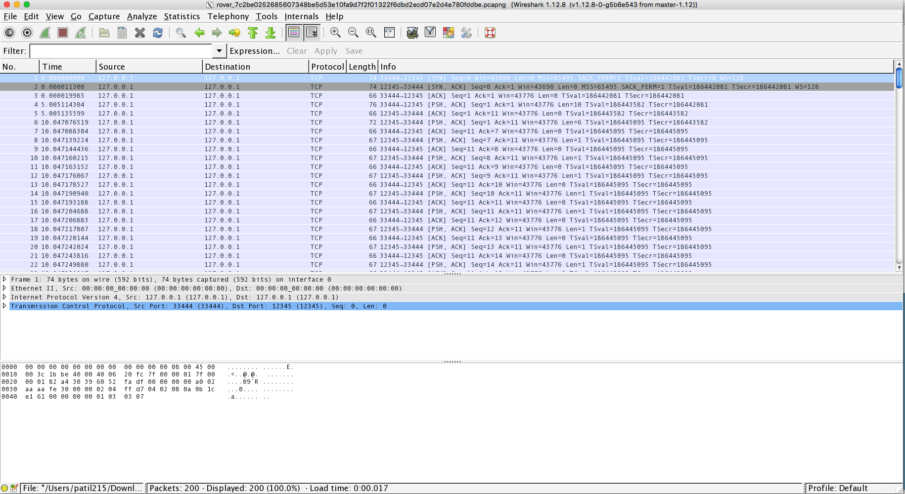
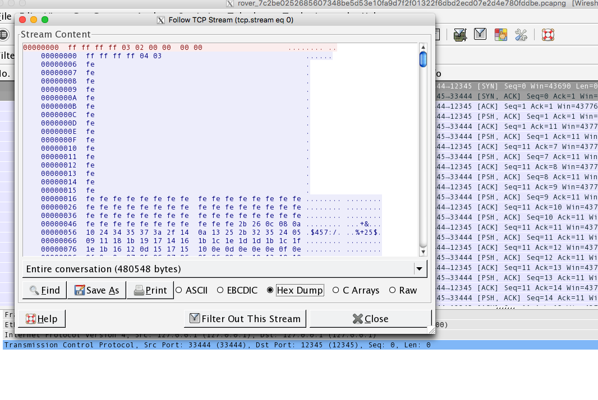
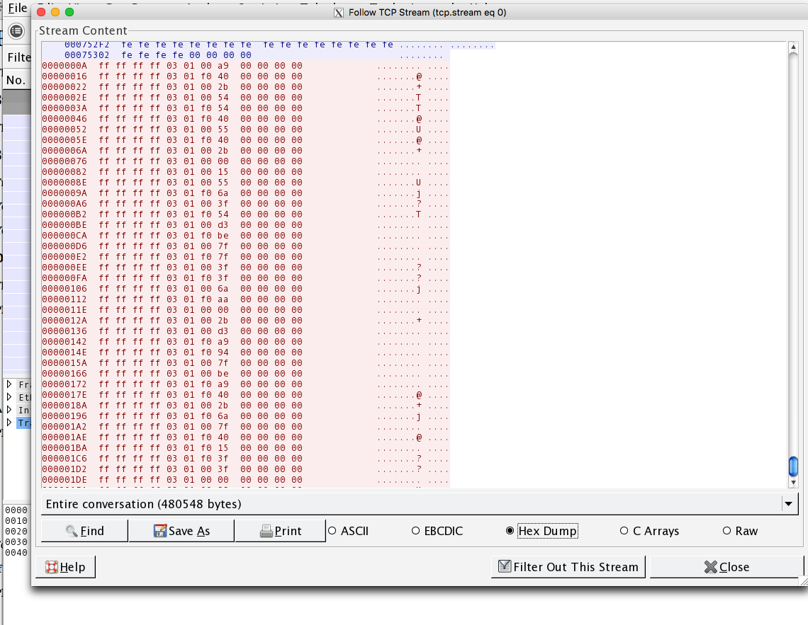

# roverctl - 100 (Misc)
#### Writeup by Neil Patil

## Problem ##
Looks like the backdoor you installed on *Pathfinder* is working; you've captured [these packets](rover.pcapng). But what do they all mean? [Maybe this will help.](roverctl.pdf)

## Answer ##

### Overview ###

Read through the attached PDF to become familiar with the rover command specifications. Then, use a packet analysis tool (like Wireshark) to get the full transmission. Interpret the commands, and use them to decipher a hexadecimal message like in the movie *The Martian*.

### Details ###

In roverctl, we're given a transmission between the sender (presumably Houston) and the rover Pathfinder. The attached PDF document is extremely helpful here - it gives details of how the encoding works. Reading through it, we become familiar with specifically sending back an image and also the camera movement commands - these are the ones that are transmitted, as you'll see.

A pcapng file details a list of "packet captures", or network traffic. In this case, it's between the rover and home base. There are tools that'll let us view the pcapng file and see the contents of the transmission. One such tool is [Wireshark](https://www.wireshark.org/).

Opening the file in Wireshark, we get:



We can see that the transmission is broken up into different packets. However, it'd be nice to have the full message all at once. Wireshark lets us do this with `Right Click -> Follow TCP Stream`.

Viewing it in the Hex Dump format, we then get this:



This looks as lot like the commands detailed in the PDF! It looks like at the beginning, Houston is requesting an image - as indicated by the `03 02` following the `ff ff ff ff` command to start. The rover is then responding with an image - indicated by `04 03` (as detailed in the PDF). It's then followed by a ton of hex values that indicate grayscale pixel values of the image, according to the PDF specifically:

"Image acquisition responses will return a grayscale 800x600 image. Each pixel will be represented by a single byte. 00 will represent a black pixel, and ff will represent a white pixel. Other values are shades of gray."

We can write a script to read in these pixel values and generate the image (I used the [Python Imaging Library](http://www.pythonware.com/products/pil/)):

```
from PIL import Image

words = []

file = open("img", 'r')

for line in file:
  for word in line.split():
    words.append(word)


imgsize = (800, 600)
img = Image.new("RGB", imgsize)
pixels = img.load()

print len(words)

k = 0
for d in range(0, 800):
  for i in range(0, 600):
    val = int(words[k], 16)
    pixels[d,i] = (val, val, val)
    k += 1
img.save('output.jpg')
```

This generates this image:


The text on the paper is a bit hard to read, but the interesting part is the fact that 0 and f are hung up on the page. Hmmm...

Let's look at the rest of the commands transmitted. At the end of the TCP stream, we see this:



These are a bunch of commands for rotating the head of the robot! Hmm... this reminds me of that one movie.

In the Martian, the main character receives messages from Earth by [having the robot point at a series of hexademical cards laid out in a circle around the robot's camera](http://www.techinsider.io/the-martian-hexidecimal-language-2015-9). Perhaps this is the same way!

Let's try it - we can write a script that takes in the list of camera rotation commands, and simulates the rover rotating the camera according to the spec detailed in the PDF. We can put together all the hexadecimal values and decode to get our flag!

```
file = open('instru.txt', 'r')

lines = []
for line in file:
  lines.append(line)

for shift in range(0, 16):
  pos = 0.0
  out = ""
  length = 0
  for line in lines:
    length += 1
    direction = line.split()[0]
    amount = int(line.split()[1], 16)
    multiplier = 1
    if not direction == "00":
      multiplier = -1
    pos = pos + (amount * multiplier)

    card = pos / 21.1764706 # 21.17 is 360 / 17, evenly dividing the number of hexadecimal cards

    letter = hex((int(round(card) + shift) % 16))
    print letter
    out += letter[2:]
  print out.decode('hex')
```

The script works and we get the flag.

### Flag ###
  tjctf{i_lik3_potat03s}
